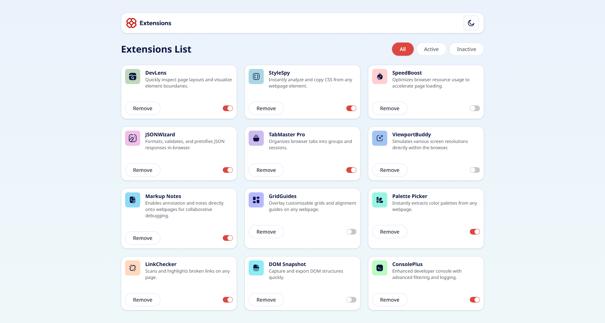

# Frontend Mentor - Browser extensions manager UI solution

This is a solution to the [Browser extensions manager UI challenge on Frontend Mentor](https://www.frontendmentor.io/challenges/browser-extension-manager-ui-yNZnOfsMAp). Frontend Mentor challenges help you improve your coding skills by building realistic projects. 

## Table of contents

- [Overview](#overview)
  - [The challenge](#the-challenge)
  - [Screenshot](#screenshot)
  - [Links](#links)
- [My process](#my-process)
  - [Built with](#built-with)
  - [What I learned](#what-i-learned)
  - [Continued development](#continued-development)
  - [Useful resources](#useful-resources)
  - [AI Collaboration](#ai-collaboration)
- [Author](#author)
- [Acknowledgments](#acknowledgments)

## Overview

### The challenge

Users should be able to:

- Toggle extensions between active and inactive states
- Filter active and inactive extensions
- Remove extensions from the list
- Select their color theme
- View the optimal layout for the interface depending on their device's screen size
- See hover and focus states for all interactive elements on the page

### Screenshot



### Links

- Solution URL: [Repo Url](https://github.com/benAloo/browser-extensions-manager-ui-main/)
- Live Site URL: [Live site Url](https://benAloo.github.io/browser-extensions-manager-ui-main/)

## My process

### Built with

- Semantic HTML5 markup
- CSS custom properties
- Flexbox
- CSS Grid
- Mobile-first workflow
- [React](https://reactjs.org/) - JS library
- [Vite](https://vite.dev/) - Vite
- [Tailwindcss](https://tailwindcss.com/) - For styles
- [SVG-Crop](https://svgcrop.com/) - For converting the logo to svg
- [Typescript](https://www.typescriptlang.org/) - For type-safety

### What I learned

```html
  <body class="font-sans bg-light-gradient dark:bg-dark-gradient min-h-screen px-4 py-10 transition-colors duration-200 md:px-8">
    <div id="root"></div>
    <script type="module" src="/src/main.tsx"></script>
  </body>
```

```css
--background-image-light-gradient: var(--light-gradient);
--background-image-dark-gradient: var(--dark-gradient);
```

```ts
<Switch
  checked={item.isActive}
  onCheckedChange={() => toggleExtension(item.name)}
  className="cursor-pointer transition-colors data-checked:bg-Red-500 data-unchecked:bg-Neutral-300 dark:data-unchecked:text-Neutral-700"
/>
```

### Continued development

Use skeleton component from Shadcn to mimic optimistic UI

### Useful resources

- [Shadcn Components](https://ui.shadcn.com/docs/components) - This helped me reference some components I used in the project. I really liked this pattern and will use it going forward.
- [Tailwindcss Docs](https://tailwindcss.com) - This helped reference some class naming convention for tailwindv4

### AI Collaboration

- What tools did you use (e.g., ChatGPT, Claude, GitHub Copilot)? - I used Gemini
- How did you use them (e.g., debugging, generating boilerplate, brainstorming solutions)? - refactoring index.css file to use the custom colors provided in style-guide.md
- What worked well? What didn't? - everything worked well, except everytime I give it code to maybe make a small change it reference the old generated code and remove the styling that I have used myself and was poor with knowledge on tailwindv4

## Author

- Frontend Mentor - [@benAloo](https://www.frontendmentor.io/profile/benAloo)

## Acknowledgments

- Got inspiration by [React, Reusable components, styling using Tailwindcss](https://www.frontendmentor.io/solutions/react-reusable-components-styling-using-tailwindcss-usIn81VruJ) by [abok-cymk](https://www.frontendmentor.io/profile/abok-cymk)
